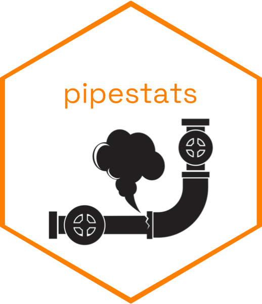

<!-- README.md is generated from README.Rmd. Please edit that file -->

# pipestats 

<!-- badges: start -->

[](https://github.com/ganesko/pipestats/actions/workflows/R-CMD-check.yaml)
<!-- badges: end -->

R Package for Gas Pipeline Incident Data

This package cleans, joins, and documents gas pipeline incident data
from 1970 to present day from the Pipeline and Hazardous Materials
Safety Administration.

## Installation

You can install the development version of pipestats from
[GitHub](https://github.com/) with:

``` r
# install.packages("pak")
pak::pak("ganesko/pipestats")
```

You can load the package with:

``` r
library(pipestats)
```

## Examples

The cleaned and joined dataset capabilities provided by this package
make many different visual analyses of gas pipeline data possible. The
following visualization is a 2025 version of Fig. 1 in the 2022 Dixon
et. al. paper titled State-of-the-Art Review of Performance Objectives
for Legacy Gas Pipelines with Pipe-in-Pipe Rehabilitation Technologies.
With the load_recent_data() and merge_data() functions in this package,
users can recreate even more up-to-date versions of this visualization
and others for in-depth analysis of gas pipeline incident causes and
variable relationships.

``` r
# load packages
library(dplyr)
library(ggplot2)
library(lubridate)
library(scales)
library(paletteer)

# filter for mains
data(cleaned_full_incident_data_1970_mar2025)
mains_df <- subset(cleaned_full_incident_data_1970_mar2025, select = c(CAUSE, SOURCE, SYSTEM_PART_INVOLVED, LOCAL_DATETIME, NATURAL_FORCE_TYPE)) %>%
  filter(SYSTEM_PART_INVOLVED == "MAIN") %>%
  mutate(LOCAL_DATETIME = ymd_hms(LOCAL_DATETIME))

# count total observations
main_n <- nrow(mains_df)

# reorder sources
mains_df$SOURCE <- factor(mains_df$SOURCE, levels = c("incident_gas_distribution_jan2010_present", "incident_gas_distribution_mar2004_dec2009", "incident_gas_distribution_mid1984_feb2004", "incident_gas_distribution_1970_mid1984"))

# bar plot
ggplot(mains_df, aes(x=CAUSE, fill=SOURCE)) + 
  geom_bar() +
  coord_flip() + 
  scale_y_continuous(sec.axis = sec_axis(trans = ~./main_n, labels = percent)) +
  scale_fill_paletteer_d(name = NULL, labels = c("2010-2024", "2004-2009", "1984-2004", "1970-1984"), "ltc::fernande") + 
  labs(title = "Incident Causes for Gas Pipeline Mains",
       x = NULL, 
       y = "Incidents") + 
  theme_bw() + 
  theme(legend.position = "inside", 
        legend.position.inside = c(0.8, 0.2), 
        legend.box.background = element_rect(colour = "black"))
```

 This
second visualization demonstrates the cleaned and joined dataset’s use
for analysis of gas pipeline incidents by material over time. There has
been high demand for replacement of legacy cast/wrought iron mains, as
many have argued that their risk of corrosion increases their number of
often costly incidents compared to other materials. Yet this figure
shows that the property damage caused by cast/wrought iron mains has on
average decreased over time, while the damage caused by plastic mains
has had a significant spike and the damage caused by steel mains has
increased, recommending further investigation into incident variables by
material and other incident reduction strategies before expensive
investments into pipeline replacement projects.

``` r
cost_df <- cleaned_full_incident_data_1970_mar2025 %>%
  filter(SYSTEM_PART_INVOLVED == "MAIN") %>%
  mutate(
    TOTAL_PROP_COST = EST_COST_OPER_PAID + EST_COST_PROP_DAMAGE,
    MATERIAL = recode_factor(MATERIAL_INVOLVED, 
                             "CAST IRON" = "CAST/WROUGHT IRON",
                             "WROUGHT IRON" = "CAST/WROUGHT IRON",
                             "OTHER PLASTIC" = "PLASTIC",
                             "POLYETHYLENE PLASTIC" = "PLASTIC"),
    LOCAL_DATETIME = as.Date(LOCAL_DATETIME)
  ) %>%
  filter(MATERIAL %in% c("CAST/WROUGHT IRON", "PLASTIC", "STEEL")) %>%
  filter(LOCAL_DATETIME >= as.Date("2004/01/01") & LOCAL_DATETIME <= as.Date("2024/01/01")) %>%
  mutate(
    time_bin_2 = cut(
      LOCAL_DATETIME,
      breaks = seq(as.Date("2004-01-01"), as.Date("2025-01-01"), by = "2 years"),
      labels = c('2004-2006', '2006-2008', '2008-2010', '2010-2012', '2012-2014', '2014-2016', '2016-2018', '2018-2020', '2020-2022', '2022-2024'),
      right = FALSE
    )
  ) %>%
  group_by(MATERIAL, time_bin_2) %>%
  summarise(mean_total_cost = mean(TOTAL_PROP_COST, na.rm = TRUE), .groups = "drop")

ggplot(cost_df, aes(x = time_bin_2, y = mean_total_cost, color = MATERIAL, group = MATERIAL)) +
  geom_smooth(method = "loess", se = FALSE) +
  labs(
    title = "Property Cost Trends of Gas Pipeline Mains Incidents by Material",
    x = NULL,
    y = "Mean Total Property Cost (USD) of 2-year Time Interval",
    color = "Material"
  ) +
  scale_y_continuous(breaks = seq(0, 1200000, by = 150000), 
                     labels = label_comma()) +
  theme_minimal() +
  theme(
    axis.text.x = element_text(angle = 45, hjust = 1)
  )
```


